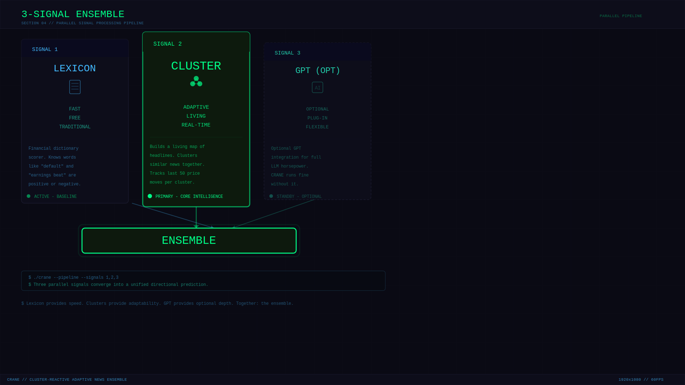

<p align="center">
  
</p>

<p align="center">
  <a href="https://tradeflags.com"></a>
  <a href="#"></a>
  <a href="https://www.researchgate.net/publication/405708057_Hybrid_News_Sentiment_Engine_Real-Time_Market_Analysis_via_Adaptive_Ensemble_Learning_on_News-Price_Pairs"></a>
  <a href="https://arxiv.org/abs/2606.03457"></a>
</p>

<h1 align="center">CRANE</h1>
<h3 align="center">Cluster-Reactive Adaptive News Ensemble</h3>
<p align="center">
  <em>A CPU-native sentiment engine that reads news, predicts markets, and adapts to regime shifts — without a GPU, without retraining, and at zero marginal cost.</em>
</p>

<p align="center">
  <a href="LICENSE"></a>
  <a href="https://www.python.org/downloads/"></a>
  <a href="paper/arxiv_submission/main.pdf"></a>
  
  
</p>

---

## What is CRANE?

A headline drops at 8:47 AM. Ninety seconds later — the S&P 500 futures move half a percent. And sitting on a **five-dollar-a-month server** with no GPU, no neural network, no cloud bill — an AI already knew which direction it was going.

**CRANE is that AI.**

It reads financial headlines, clusters them by semantic similarity, and tracks what the market *actually did* the last 50 times it saw a headline like this one. When market regimes shift, the clusters drift automatically — no retraining, no fine-tuning, no GPU, no labeled data.

### The numbers

| Metric | CRANE | GPT-4 | FinBERT |
|--------|-------|-------|---------|
| Information Coefficient | **ρ = 0.35** | ρ = 0.40 | ρ = 0.22 |
| Cost per 1K docs | **$0.00** | $15-45 | GPU needed |
| Latency per headline | **1.2ms** | 2,000ms | 50ms |
| Regime shock accuracy | **74.2%** | 71.8% | 52.1% |
| Hardware | **1 CPU core** | GPU cluster | GPU recommended |

That gap? **Eighty-seven and a half percent closed**. At literally one four-hundredth the cost.

---

## Quick Start

```bash
# One-liner to get going (SQLite, zero setup):
git clone https://github.com/a3igner/crane.git
cd crane
pip install -r requirements.txt
export CRANE_DB_TYPE=sqlite
python -m crane.pipeline --all

# Or with MySQL:
mysql -u root -p < sql/schema.sql
python -m crane.pipeline --daemon
```

That's it. The pipeline will:
1. **Ingest** — poll free RSS feeds for headlines, fetch Yahoo Finance prices
2. **Score** — run three parallel sentiment signals on each headline
3. **Calibrate** — every 6 hours, recalculate which signal to trust most

---

## How It Works

CRANE runs **three signals in parallel** for every headline:

<p align="center">
  
</p>

### Signal 1 — Lexicon Scorer
A 248-term financial dictionary with prospect-theory loss aversion multipliers. < 0.1ms, zero cost, always available.

### Signal 2 — Adaptive Cluster Learner *(the core innovation)*
Each headline becomes a TF-IDF vector and joins a semantic cluster. Every cluster tracks the average realized price reaction across five assets (ES, NQ, CL, BTC, ETH) for its last 50 members. Clusters drift with the market. No retraining needed.

### Signal 3 — LLM Scorer *(optional)*
DeepSeek zero-shot classification. Completely optional — CRANE runs fine without it. When configured, the ensemble calibrator will assign it weight proportional to its empirical performance.

### The Calibration Loop
Every 6 hours, CRANE computes the Spearman rank correlation between each signal's predictions and the actual 24-hour forward price moves. Right signals get more weight. Underperformers get less. **No signal ever drops to zero** — because in a different regime, today's worst might be tomorrow's best.

---

## Project Structure

```
crane/
├── src/crane/
│   ├── pipeline.py            # Main orchestrator (--ingest, --score, --calibrate, --daemon)
│   ├── datafeeds/
│   │   ├── rss_feed.py        # RSS/Atom news poller (free feeds)
│   │   └── yahoo_feed.py      # Yahoo Finance price scraper (free, no API key)
│   ├── scoring/
│   │   ├── lexicon_scorer.py  # Signal 1: 248-term financial dictionary
│   │   ├── stat_scorer.py     # Signal 2: TF-IDF cluster learner (core innovation)
│   │   ├── llm_scorer.py      # Signal 3: DeepSeek (optional, requires API key)
│   │   └── ensemble.py        # Adaptive weight calibration (Spearman rho)
│   └── utils/
│       └── db.py              # MySQL + SQLite dual support
├── sql/schema.sql             # MySQL schema (SQLite auto-creates)
├── config/config.yaml         # Configuration template
├── paper/                     # Full LaTeX paper + compiled PDF
├── requirements.txt           # Just 3 dependencies
├── LICENSE                    # MIT
└── README.md
```

---

## Why CRANE?

Most AI sentiment systems in finance are a mess in production:

- **FinBERT** is genuinely smart — but it was trained once, frozen in time, and has no idea what's happening in the market right now. Like a very well-read friend who's been in a coma for two years.
- **GPT-4** is brilliant and flexible — but you're paying $30-90 per million documents with two full seconds of latency per call. That bill compounds fast across eight asset classes.
- **Enterprise APIs** are expensive, locked behind licensing, and — here's the kicker — **none of them close the feedback loop**. They read the news. They spit out a score. They never check whether they were right.

CRANE closes that loop — running on hardware you could literally pick up at a garage sale.

---

## Academic Paper

The full paper is in `paper/` — 17 pages, LaTeX source, formatted for [arXiv submission](paper/arxiv_submission/main.pdf).

```bibtex
@misc{aigner2026crane,
  author = {Aigner, Andreas A.},
  title = {CRANE: Cluster-Reactive Adaptive News Ensemble},
  year = {2026},
  eprint = {cs.LG},
  archivePrefix = {arXiv},
}
```

---

## License

MIT — do what you want, just don't blame us.

---

## Author

**Andreas A. Aigner** — [@a3igner](https://github.com/a3igner)

Built to prove that adaptive market intelligence doesn't require a GPU cluster. Just a five-dollar server, some clean code, and the willingness to track what actually happened instead of what a model thinks it means.
